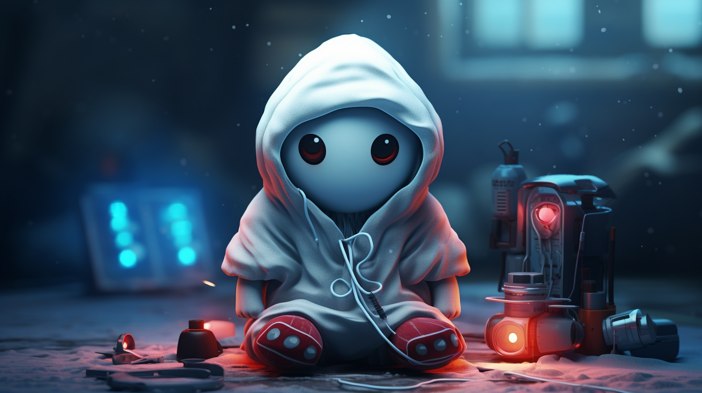

# One of us - an Aleo experience


# Overview

## Inspiration and Background
"One of Us" melds the classic "innocent vs traitor" gameplay with state-of-the-art zero knowledge on-chain mechanics. Drawing inspiration from beloved games like Mafia, Avalon, and Among Us, it's not just a game – it’s a journey into the depths of strategy, suspense, and social interaction whose goal is to grow and strengthen the Aleo community.

## Core Gameplay
Players unite with a common objective, but lurking among them are traitors with a mission to sabotage. Here's how the game unfolds:

- Majority of players are innocents, with few randomly chosen as traitors.
- Innocents aim to complete tasks across the map, survive and vote out the traitors.
- Traitors try to blend in, eliminating innocents and hindering progress.
- Communication towers scattered across the map are hubs for information exchange and player voting.
- Tools and special abilities are found randomly in the map or awarded for task completion.
- Rounds are marked by the resolve of a voting event following a communication and proposal.
- Victory conditions: Game ends when either all traitors are ousted, or traitors make up more than half of the remaining players. 
- An example traitor distribution: in a 4-player game, there's 1 traitor, while in an 8-player setup, there are 2 traitors.
- Private data such as traitor identity, player locations and voting behaviour are all stored on the Aleo blockchain. This functionality wouldn't be possible in other chains as the zero knowledge computaiton is critical to make this work on chain.

## Monetization and Community Incentives

- Maps with diverse themes form the backbone of the game, each represented as a unique NFT with distinct themes, tools, and narratives.
- Themed character skins, tailored for each map, add layers of customization.
- A sustainable model rewards both players and creators:
  - Play for free and enjoy the game
  - Play competitive mode with a buy-in cost that goes towards a prize pool:
    - 80% distributed to the winners of the game
    - 10% to open-source Aleo contributors that are not employed by the Aleo company
    - 8% to the "One of us" core team to fund development of the game
    - 2% to the map NFT holder thus incentivizing artists and creators to make content


Monetization within "One of Us" is designed to foster sustainability of the project long term so that it becomes self-sufficient and can host a free market of ideas and asset creation. By integrating financial incentives at every level, from players to creators, the game not only rewards engagement but also encourages the creation of novel content. Maps, represented as NFTs, and character skins provide tangible assets for creators and artists, with the potential for them to earn every time their creation is engaged with in the gaming arena. This not only spurs a steady stream of fresh content, enhancing gameplay variety, but also forms a virtuous circle: as more creators are incentivized, player engagement rises, leading to a more self propelled thriving community. Furthermore, by allocating a portion of the prize pool to open-source contributors and the core development team, there's a continuous funding mechanism in place to refine, expand, and innovate the gaming experience. 
This holistic approach to monetization ensures that "One of Us" is not just a game but a self-sustaining ecosystem that thrives on mutual growth and shared success. By also paying it forward to open-source Aleo contributors that are not employed by the Aleo company we remain humble and make sure the foundation, in this case development of the Aleo and Leo language remains appreciated. 

## Our Vision

We've expanded beyond the scope of just a smart contract. Our aim is to deliver a captivating experience and grow the Aleo community. Through strategic design and economic incentives, "One of Us" is a long term vision to build a thriving ecosystem of players, creators, and developers.


# Technical details

## Build Guide

Install Leo. If you haven't installed Leo before follow the [Leo Installation Instructions](https://developer.aleo.org/leo/installation)
Make sure the working directory is in this folder *oneofus*
```bash
cd oneofus
```

Simply run the script which already contains multiple function execution examples
```bash
.\run.sh
```


## Components

```rust
    struct Player {
        id: address,        // the Aleo public address of the player
        innocent: bool,     // true for innocent, false for traitor
        alive: bool,        // true for alive, false for dead
        location: u16,      // location of the player in the map, stored as the cell id in the map, precise location only needed in the UI
    }
```
```rust
    record game_state { 
        owner : address,    // owner of the game is the one who creates a new instance of the game
        player1 : Player,   // this demo is limited to 4 players but we aim to make it configurable in the near future
        player2 : Player,
        player3 : Player,
        player4 : Player,
        round: u8,          // keeps track of rounds, increments from 0
        game_started: bool, // keep track of game status
        map: Map,
    }
```
```rust
    struct Map {            // Maps will be external contracts with tradable NFT ownership
        creator: address,     // current owner of the Map that gets paid from games played in this map
        data: field,        // link to data storage, could be on Aleo or external storage
        meta: field,        // extra storage for keeping track of map version or other tags
        locations: field,   // encoded information of predetermined location of 
        tools: field,       // random distribution of 26 tool throughout the 32x32 grid map, encoded using 
        tasks: field,       // encoed tasks that are available in this map and their status
    }
```
```rust
    struct Task {
        id: u8,             // id of the task type
        completed: bool,    // default at false, turns true once done
        sabotaged: bool,    // true for alive, false for dead
        location: field,    // location on map
    }

    mapping tasks: field => Task; 
```
```rust
    struct Tool {           //Tools are found randomly thought the map and grant player abilities
        id: u8,             //Tool id
        data: field,        //link to data storage, could be on Aleo or external storage
        meta: address,      //extra storage for keeping track of version or other tags
        location: field,    //encoded information of predetermined location of 
        found: bool,        //whether the tool has been found by a player
        player: address,    //player in possetion of the tool if found
        remaining_use: u8,  //remaining uses of the ability, tools that can only be used once start with this value set at 1
    }
```
```rust
    struct Proposal {
        proposer: address,  // player that created proposal
        memo: field,        // encoded message   
        killer: address,    // the suspect that the proposer believes is the traitor
        decided: bool,      // if decision has been taken
        kill: bool,         // decision to kick or kill suspect
    }

    // store prosal in storage
    mapping proposals: field => Proposal; 
```
```rust
    record Communication {
        owner: address,     // player that started this communication
        id: field,          // id of communication
        info: Proposal,     // proposal sent in this communication
    }
```
```rust
    record Vote {           // votes are seperate in their own record to keep them private
        owner: address,     // player that is voting
        pid: field,         // proposal id
    }

    // Count the total votes issued for each communication / proposal to kill
    mapping votes_count: field => u64;
    mapping agree_votes: field => u64;
    mapping disagree_votes: field => u64;
```

It's important to acknowledge that our comprehension of cryptography isn't great. However, based on what we currently understand, Aleo employs a  [377 bit base field size](https://developer.aleo.org/advanced/the_aleo_curves/overview). This implies the maximum representable number is 2^377−1, constraining our encodable data to this number. Our map design currently accommodates a 32x32 grid for tool generation, permitting the encoding of 16 distinct tools per map using just 4 bits each. We apply a sparse encoding method: the tool's position within a grid cell requires 14 bits, 10 of which denote its position within the 32x32 grid (totaling 1024 positions). Given 377 bits, this format enables us to store information for 26 non-default tools randomly distributed on each map.
Here is a proof of concept encoding in JS showing the tool enconding:

```js
const encodeToolData = (toolData) => {
  let encodedNumber = BigInt(0);

  toolData.forEach(({ position, toolType }) => {
    let encodedCell = (BigInt(position) << 4n) | BigInt(toolType);
    encodedNumber = (encodedNumber << 14n) | encodedCell;
  });

  return encodedNumber;
};

const decodeToolData = (encodedNumber) => {
  const toolData = [];
  const toolMask = BigInt(0b1111); // Last 4 bits for tool type
  const positionMask = BigInt(0b1111111111) << 4n; // Next 10 bits for position
  
  while (encodedNumber > 0n) {
    const toolType = Number(encodedNumber & toolMask);
    const position = Number((encodedNumber & positionMask) >> 4n);
    
    toolData.unshift({ position, toolType });  // unshift to maintain order due to extraction from least significant bits
    encodedNumber >>= 14n;
  }

  return toolData;
};

// Example usage:
const tools = [
  { position: 621, toolType: 8 },
  { position: 250, toolType: 3 },
  // ... Add up to 26 non-default tools
];

const encoded = encodeToolData(tools);
console.log('Encoded Number:', encoded);

const decoded = decodeToolData(encoded);
console.log('Decoded Tools:', decoded);

```


For encoding player communications, we utilize 5 bits to represent a set of 32 characters: 26 letters, one space, and 5 punctuation marks. This system enables us to convey messages of up to 75 characters in length.

```js
const CHAR_MAP = ' abcdefghijklmnopqrstuvwxyz.,?!-';
const BITS_PER_CHAR = 5; // 2^5 = 32, which can represent 32 chars

const encodeText = (text) => {
    let encoded = BigInt(0);
    for (let char of text) {
        const index = CHAR_MAP.indexOf(char);
        if (index === -1) throw new Error(`Character "${char}" not supported.`);
        encoded = (encoded << BigInt(BITS_PER_CHAR)) | BigInt(index);
    }
    return encoded;
};

const decodeText = (encodedNumber) => {
    let decoded = '';
    while (encodedNumber > 0n) {
        const index = Number(encodedNumber & BigInt((1 << BITS_PER_CHAR) - 1));
        decoded = CHAR_MAP[index] + decoded; // Add at the beginning
        encodedNumber >>= BigInt(BITS_PER_CHAR);
    }
    return decoded;
};

// Example:
const text = 'hello, world!';
const encoded = encodeText(text);
console.log('Encoded:', encoded);

const decoded = decodeText(encoded);
console.log('Decoded:', decoded);

```

## Progression
1. Anyone can start a game by initializing an instance of game state.
2. Players start by connecting their Leo browser wallet to the browser based game
3. The game UI will allow for creation of lobbies and joining of games
4. When creating games players will be able to choose maps, default ones and custom maps created by the community
5. Once the lobby is full, The on chain contract will randomly determine the traitors and this information will be privately stored on chain
6. Once the game starts players are free to move around the map and explore
7. Innocent players are incentivized to complete the tasks to win
8. Exploring and completing tasks rewards them with Tools and abilities
9. Traitors are incentivized to blend in to avoid detection
10. Traitors can sabotage tasks to delay completiion
11. *There is an idea to connect task completion with Aleo proof generation so that there is meaningful work to be done and thus contributing to the network itself but also introducing a verifyable way that work was done to reduce the ways one could game the system. At the time we are unsure how to do this so it remain in the whiteboard.*
12. Players can use Map locations such as communication stations to initiate a vote when they observe suspicious behaviour.
13. Once the browser based game is ready we aim to add proximity voice chat for players to interact in game.
14. When exploring players can find and use tools to help them win.
15. Proposals are resolved once enough people has voted to take an action such as kicking a suspicious player out of the game when they believe that that player was a traitor.
16. The game ends when the traitors are voted out, the innocents complete all their tasks or if the traitors make up 50% or more of the surviving population after having killed enough innocents.


## Current limitations
```
Web worker: Deployment fee estimation completed in 1107490.7999999523 ms
worker.js:214 Deployment Fee Estimation: 1008494000 microcredits
```
The current contract, because of its size, costs 1008.504 credits 😅 to deploy on testnet and we only have a record with 50 credits from the faucet so the deployed contract is much smaller, but remember that you can run it locally without limitations.
During the next stages of development we aim to optimize storage using more bitfields and tighter compressed data. We also aim to split the contract into multiple smaller ones when it becomes possible.

During our testing we found some limitations with the language that we have shared in discussions in the discord channel:
1. Importing records from a different program when a record contains structs as a field, doesn't work as intended.
  This means that we can't split up the current design in smaller chunks but as the import function is upgraded in future Leo releases we'll be able to improve our code.
```rust
// running
  import apple.leo;

  program test.aleo {

    transition main() -> apple.leo/Obj.record {
        return apple.leo/init();
    }

  }
// where
  program apple.aleo {

    struct Apple {
        ripe: bool 
    }

    record Obj {
        owner: address,
        apple : Apple,
    }

    transition init() -> Obj {
        return Obj {
            owner: self.caller,
            apple: Apple { ripe : true },
        };
    }
    
  }
// outputs
Invalid record entry 'Obj.apple': Struct Apple' is not defined in the program
```

2. Returning data from a nested struct. For some reason snarkVM doesn't like it when we try to return a struct nested within another struct. We believe this is a limitation of the instructions as current instructions only accept literal types but the compiler still accepts this code
```rust
// running
    struct Row {
        c1: u8,
        c2: u8,
        c3: u8
    }

    struct Grid {
        r1: Row,
        r2: Row,
        r3: Row,
    }

    transition new(grid: Grid, index: u8) -> Row {
        if index == 1u8 {
            return grid.r1;
        } else {
            return grid.r2;
        }
    }
// outputs
SnarkVM Error: Expected literal type, found 'Row'
```
3. Limitations with reading from mappings. With the current design Mapping::get() can only be read in a Finalize() and Finalize() can't return data, so makes reading the data stored in mappings difficult to be used in the program. One workarond is to input the data manually in a function, and assert equivalance of the assumption with the data stored in mappings but that becomes tricky very quickly with complex contracts such as "One of us". 

Note that the current version of "one of us" does not incude all the functionality we'd like to have due to the above limitations but that does not discouage us to persue it further as this phase of the incentivize testnet is purposely designed to discover limitations and test functionality before mainnet. With mainnet approaching are confident that we'll be able to finish all the other funcitonality and have all the nessesary game functions on chain.

## Generating randomness

Generating randomness is crucial to correct operation of the game as this randomness is used to pick the traitor without revealing it to all the players or generating random tools throughout the map for players to discover. When it comes to feasibility Aleo should be one of the few blockchains where actual randomness can be generated because of its zk capabilities can be used to concel parts used to make the key. Such design we are considering include:
1. Commit-Reveal Schemes: One way to introduce randomness is to have users submit a "commitment" to a random number, then reveal the number later.
2. Latest Block Information: Use some data from the latest block as a source of randomness. This is not random and can be subject to manipulation. But can be used as salt.
3. VDFs (Verifiable Delay Functions): This is a function that takes a certain amount of time to compute, but the result can be verified quickly. It can be used to generate random numbers in a way that is difficult for an attacker to predict in advance.
4. Use of Oracles: External services can introduce randomness into the system. However, this relies on the external oracle.
5. Accumulators: This involves having users submit random values over time, which are combined (e.g., hashed together) to produce a final random value. We'd need to write the contract to do this and make sure the combined data remains private to the players
6. BLS Signatures: Boneh-Lynn-Shacham signatures submited by network validators.
7. In built generator on the VM if one exists or can be done

Overall its a tough problem to solve properly but we have the ideas above to experiment with. This definitely needs some more research or feedback from the core developers.


# Why we chose to build this game

From the outset, we asked ourselves: "How can we help build a robust community for Aleo?" As an emerging cryptocurrency yet to debut on the mainnet, Aleo stands at a pivotal juncture. Now is the opportune moment to rally an exceptional community dedicated to nurturing its growth. Our vision surpasses merely crafting a game or a contract; we envisage a strategic roadmap that germinates from this initial effort and blossoms with dedicated care.

"One of Us" is a pioneering multiplayer on-chain game. This experience harnesses the 'innocent vs. traitor' dynamic, a mechanism that delves deep into human psychology, forging social bonds. By incentivizing both players and creators, we aim to establish lasting economic sustainability.

Aleo, in its nascent stage, offers a unique proposition. It stands out due to its intrinsic capability to maintain data confidentiality, it champions privacy technology, enabling functionalities not feasible on platforms like Ethereum. This encompasses keeping pivotal game aspects, such as player roles, locations, abilities, and voting patterns, private.


## Showcase the advanced features of Leo

The inception of “One of Us” stemmed from our desire to create a multifaceted game that would aptly demonstrate the sophisticated capabilities Leo possesses.

- **Privacy**: Essential to our game is the element of concealed knowledge, ensuring that not every player possesses complete information. This design choice seamlessly integrates with Aleo's privacy features, utilizing zero-knowledge proofs to obscure player identity, votes, map location, and player abilities.
- **Testnet 3 Exploration**: Our ambition with the testnet was to stretch its limits, examining its strengths and weaknesses. By constructing an expansive game environment, we aimed to potentially find the current boundries. Indeed, our efforts revealed some constraints within the current language state which we have shared with the community and hope to contribute to its evolution.
- **Engagement with the Leo Community**: Pushing Leo's functionalities to the brink fostered a dynamic dialogue with the Leo community. Through discussions and technical sharing on Discord, we not only deepened our understanding of the language but also cultivated valuable connections with other developers.

## Using game design and human psychology to captivate players

**"One of us"** uses the innocent vs. traitor mechanic to create tension, distrust, and strategic gameplay, making them engaging and replayable as players attempt to deduce who they can trust. This is important to build engaged communities around Aleo and Leo.

- **Human Psychology and Deception**: At its core, this mechanic plays on our ability to deceive and detect deception, which is an age-old aspect of human social interaction. When you are the traitor, you're tapping into skills of persuasion, subterfuge, and bluffing. Conversely, when you're innocent, you're using deduction, intuition, and observation to detect inconsistencies and lies.
- **Dynamic Gameplay**: Each game session can be vastly different based on who is assigned the traitor role and how they choose to play it, the map where the game is being played and abilities and tools that players will find on the map. This variability makes each game feel fresh and unpredictable.
- **Emotional Highs and Lows**: The tension of being discovered as a traitor or the thrill of successfully fooling everyone can produce adrenaline. Similarly, the satisfaction of correctly identifying a traitor or the despair of being deceived creates strong emotional reactions.
- **Social Interaction**: This game is deeply social. It encourages discussion, argument, collaboration, and sometimes even playful confrontation. They can reveal facets of your friends' personalities you might not see in other settings, leading to surprising moments and memories. This is crucial to build relationships in the Aleo community that can turn strangers into friends or coworkers. 
- **Strategy and Adaptability**: While there's often a luck element involved, strategic thinking is crucial. Traitors must strategize on when and how to sabotage, while innocents must decide whom to trust and when to take risks. Players must also adapt their strategies as the game progresses and as new information is revealed.
- **Storytelling Element**: The thematic elements in the maps and characters create a narrative backdrop, whether it's the dystopian intrigue or the medieval treachery, these narratives enhance immersion, making players more invested in the outcome.
- **Accessibility and Inclusivity**: Many social deduction games have straightforward rules, making them accessible to a broad range of players, including those who might not typically play board or digital games. They're also inclusive, accommodating large groups of players.
- **Post-Game Discussion**: One unique aspect of this game is the conversation they spark afterward. Players will dissect decisions, confront traitors, commend brilliant plays, and laugh over misinterpretations. This debriefing session can be as enjoyable as the game itself.
- **Short Play Time**: "One of us" is designed to be played in a short amount of time, making it easy to fit into a game night or even play multiple rounds in one sitting. This also encourages replayability, as players will often want a chance at redemption or to try out different roles.

**"One of us"** creates a unique blend of psychological challenge, social interaction, strategy, and narrative, making it engaging. It captures the essence of human social dynamics in a playful setting, creating memorable experiences for participants.


## Inspiration

Games centered around the dynamic of "Traitors vs. Innocents" have captivated players for generations. Whether through board games or digital platforms, these games thrive on strategy, suspense, and the ever-present element of mistrust. Our design draws inspiration from iconic titles like Mafia, Resistance, Avalon, Secret Hitler, Battlestar Galactica, Shadows over Camelot, Dead of Winter, Spyfall, Saboteur, Deception and Project Winter, among others.



# Characters
Beyond the default skins game characters will be customized for each map, ownership as NFTs, check out the **[Forest example](forest.md)** to see an example of player skin NFTs made specifically for a map.


# Maps

We are designing multiple maps ourselves and hope for the economic incentives to push other creators to make their own fantasy worlds. Remember that these maps are concept art, a 2d representation of what the map will look like. 


**Medieval Castle:** In a grand castle surrounded by moats and towering walls, knights swear fealty and honor, unaware that spies are weaving webs of deceit, plotting to dethrone the monarch.
***

**Pirate raid:** Crewmates searchg for treasure and gather resources for the next raid, while Impostors are mutineers.
***

**Alien lab:** A research lab on a distant planet doing gene modification on human subjects, where Impostors are saboteurs.
***

**Corporate Skyscraper:** Employees try to finish their work, while Impostors are corporate spies trying to gather intel.
***

**Arctic Research Station:** Amidst the endless white expanse, researchers brave biting cold and blizzards to unravel the Arctic's mysteries. Yet, not all are what they seem; some may be rival agents or eerie entities birthed from the frost.
***

**Underwater Research Facility:** Beneath the ocean's waves, in the crushing deep, scientists probe the mysteries of marine life. But in the abyssal shadows, there may be threats greater than the crushing pressure and lurking sea creatures..
 ***

**Haunted Mansion:** In a mansion where whispers echo through hallways and portraits seem to watch, crewmates unravel old mysteries and repair what's broken, all while trying to discern who might be an ethereal specter with malevolent intentions.
***

**Island Resort:** On sun-kissed sands and under palm canopies, vacationers relish paradise's allure. Yet, there's mischief afoot, and someone seeks to turn this dreamy escape into a nightmare.
***

**Wild West Town:** In a town of saloons and dusty roads, gold miners and cowboys hustle for a lucky break. But amidst the gold rush frenzy, someone's playing a dangerous game, looking to profit from others' misfortunes.
***

**Ancient Pyramid:** Deep within the labyrinthine corridors of a majestic pyramid, adventurers decode hieroglyphs and dodge ancient traps. Yet, there's a shadow among them, possibly someone cursed by the gods or in league with dark forces.
***

**Sky City:** High above the earth, where platforms float and bridges sway, citizens of Sky City navigate the vertiginous heights. But as they forge ahead, they remain unaware of the saboteur among them, plotting the city's aerial downfall.
***

**Lunar Base:** In the cold, silent expanse of the moon, researchers race to unlock the secrets of lunar minerals, but among the shadows of the craters, a saboteur works to halt humanity's celestial advancements.
***

**Cyberpunk city:** Amidst the neon-lit skyscrapers and bustling digital markets of a future metropolis, hackers and corporate agents blend in, but not all want the city's digital heart to keep beating.
***

**Steampunk:** In a world powered by steam and intricate clockwork, engineers and inventors showcase their marvels, but hidden within the gears and foggy alleys, a traitor seeks to grind the city's progress to a halt.
***


### Items & Abilities

Tools can be found randomly throughout the map and grant player abilities.

- **Megaphone**: Can send a one-time anonymous message to all players without using a broadcast station.
- **Decoy deployer**: Can create a holographic clone of themselves that moves randomly.
- **ChronoScope**: Can reveal footprints of players that have visited this part of the map previously.
- **Camouflage cloak**: Can blend in with the environment, becoming invisible for a short duration.
- **Sabotage**: A traitor only ability to sabotage locations such as brodcast stations or other.
- **Tool box**: The tool box allows anyone to fix a sabotaged location.
- **Detector**: Once per game, the light turns green if there's an Impostor in the vicinity.
- **Guardian angel**: Can protect one other player from being killed for one round.
- **Medalion**: Can protect one player from being killed for one round.
- **Phoenix Feather**: The holder dies but get to come back in 2 rounds if the game is not over. 
- **Overdrive**: Can temporarily boost the speed of task completion for nearby players. 

### Map locaitons

Most locations are map specific and fit the map theme but some locations are common in all maps to allow for some core functionality

- **Broadcast station**: A discoverable location in the map that lets players send communications. The name may vary based on the map theme such as Pigeon Post, Scroll Station, Telegraph Office, Smoke Stack, Quantum Communicator, Polar Post or Arcane Whisperer based on the map theme.
- **Tunnels**: Discrete underground tunnels, shortcut or teleportation points that allow traitors to move quickly around the map.


# Thank you

Thank you to the following people on discord for the technical discussions:
- @capncrunch
- @AlexBud
- @Haruka
- @Alex Kim
- @masterchief

Thank you to **Aleo** for the [sample contracts](https://developer.aleo.org/leo/examples) that serve as excellent examples and to **Demox Labs** for the [NFT factory](https://github.com/demox-labs/art-factory/blob/main/src/aleo/nft-program.ts) that served as an inspiration for the NFT integration to the MAP system 